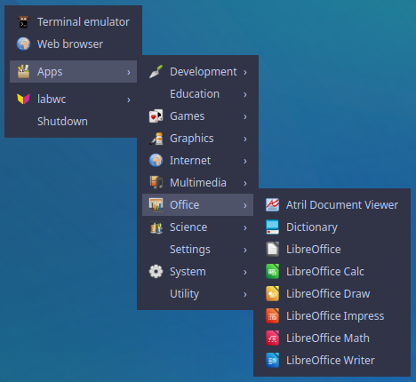

# box-menu-rs

`box-menu-rs` is a pipemenu application following the [`openbox_menu`](https://openbox.org/help/Menus) syntax.

By this, it can be integrated into the menu of [labwc](https://github.com/labwc/labwc),
[Openbox](https://openbox.org/), and potentially other window manager following this syntax.

Currently, `box-menu-rs` is only tested on Linux but might run also on other platforms as well.



## Compilation

Build `box-menu-rs` using [`cargo`](https://doc.rust-lang.org/cargo/commands/cargo-build.html).

Quick & dirty assuming you have [rust](https://rustup.rs/) installed on your system.

```
git clone https://github.com/RainerKuemmerle/box-menu-rs.git
cd box-menu-rs
cargo install --path .
```

## Configuration & Usage

After this you can integrate into your `menu.xml` to generate a sub menu for the
found applications, e.g., `$HOME/.config/labwc/menu.xml`.

```
...
  <menu id="applications-boxmenu" label="Apps" execute="box-menu-rs" icon="/usr/share/icons/Humanity/categories/24/applications-other.svg"/>
...
```

In addition, box-menu-rs can be configured via `$XDG_CONFIG_HOME/box-menu-rs/config.yml`.

Definition of which categories of desktop files to include into which output menu.
```
category_map:
  Graphics:
    output: Graphics
  ...
```

Specify how to output, e.g., adding an icon in case the default one is not found.
```
output:
  Settings:
    icon: org.xfce.settings.manager
  ...
```

Furthermore, launching `box-menu-rs` without a configuration will store the
default one.

### Screenshot Configuration

Below the `menu.xml` corresponding to the screenshot.

```xml
<?xml version="1.0" encoding="UTF-8"?>
<openbox_menu>
<menu id="root-menu" label="Openbox 3">
  <item label="Terminal emulator" icon="/usr/share/icons/hicolor/scalable/apps/kitty.svg">
    <action name="Execute"><execute>kitty</execute></action>
  </item>
  <item label="Web browser" icon="/usr/share/icons/Humanity/categories/24/applications-internet.svg">
    <action name="Execute"><execute>x-www-browser</execute></action>
  </item>
  <separator />
  <!-- This requires the presence of 'box-menu-rs' in $PATH to work -->
  <menu id="applications-boxmenu" label="Apps" execute="box-menu-rs" icon="/usr/share/icons/Humanity/categories/24/applications-other.svg"/>
  <separator />
  <menu id="openbox-options" label="labwc" icon="/usr/share/icons/hicolor/scalable/apps/labwc.svg">
    <item label="Reconfigure">
      <action name="Reconfigure" />
    </item>
    <item label="Restart">
      <action name="Restart" />
    </item>
    <separator />
    <item label="Exit">
      <action name="If">
        <prompt message="Do you really want to exit?"/>
        <then>
          <action name="Exit"/>
        </then>
      </action>
    </item>
  </menu>
  <item label='Shutdown'>
    <action name="If">
      <prompt message="Do you really want to shutdown?"/>
      <then>
        <action name="Execute">
          <execute>
            systemctl poweroff
          </execute>
        </action>
      </then>
    </action>
  </item>
</menu>
</openbox_menu>
```

## Related

The functionality of `box-menu-rs` is similar to:

* [labwc-menu-generator](https://github.com/labwc/labwc-menu-generator)
* [Openbox Pipemenu written in Python3](https://github.com/onuronsekiz/obamenu)
