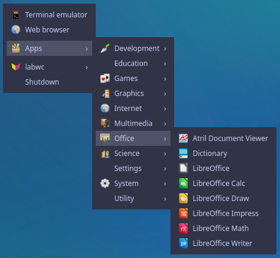

# box-menu-rs

`box-menu-rs` is a pipemenu application following the [`openbox_menu`](https://openbox.org/help/Menus) syntax.

By this, it can be integrated into the menu of [labwc](https://github.com/labwc/labwc),
[Openbox](https://openbox.org/), and potentially other window manager following this syntax.

Currently, `box-menu-rs` is only tested on Linux but might run also on other platforms as well.



## Compilation

Build `box-menu-rs` using [`cargo`](https://doc.rust-lang.org/cargo/commands/cargo-build.html).

Quick & dirty assuming you have [rust](https://rustup.rs/) installed on your system.

```
git clone https://github.com/RainerKuemmerle/box-menu-rs.git
cd box-menu-rs
cargo install --path .
```

## Configuration & Usage

After this you can integrate into your `menu.xml` to generate a sub menu for the
found applications, e.g., `$HOME/.config/labwc/menu.xml`.

```
...
  <menu id="applications-boxmenu" label="Apps" execute="box-menu-rs" icon="/usr/share/icons/Humanity/categories/24/applications-other.svg"/>
...
```

In addition, box-menu-rs can be configured via `$XDG_CONFIG_HOME/box-menu-rs/config.yml`.

Definition of which categories of desktop files to include into which output menu.
```
category_map:
  Graphics:
    output: Graphics
  ...
```

Specify how to output, e.g., adding an icon in case the default one is not found.
```
output:
  Settings:
    icon: org.xfce.settings.manager
  ...
```

Optionally, `config.yml` can also include runtime options under `options`.

```yaml
options:
  icon_theme: "Papirus"
  visibility_filter: true
```

The `icon_theme` option forces the icon theme used for icon lookup instead of
reading the default theme from the desktop environment.

This is useful when the running desktop environment does not expose the icon
theme via `gsettings`, or when you want to use a different icon theme just for
`box-menu-rs`.

The `visibility_filter` option controls whether desktop entry visibility
metadata is honored:

- `true` (default): skip `Hidden=true`, `NoDisplay=true`, and honor `OnlyShowIn` / `NotShowIn`
- `false`: include all desktop entries regardless of those visibility restrictions

Furthermore, launching `box-menu-rs` without a configuration will store the
default one.

You can also override the config source at runtime with `--config-file`.
This loads the specified YAML file instead of the default `$XDG_CONFIG_HOME/box-menu-rs/config.yml`.

```sh
box-menu-rs --config-file /path/to/config.yml
```

### Debugging icon lookup

Use `--debug-program <Name>` to inspect how a specific desktop entry is resolved.
This prints the matching desktop entry Name, Exec command, desktop icon field,
resolved entry icon path, category mapping, category icon name, and whether the
category icon was found.

Example:

```sh
box-menu-rs --debug-program "Firefox"
```

The menu XML is not printed after the debug diagnostics, instead the program terminates.

### Listing discovered programs

Use `--list <ACTION>` to inspect discovered desktop entries before generating XML. Available actions are:

- `all`: list all discovered desktop entries and their mapped categories.
- `missing-icons`: list entries whose desktop file icon lookup failed.
- `excluded`: list hidden entries that are excluded by visibility filtering.

Examples:

```sh
box-menu-rs --list all
box-menu-rs --list missing-icons
box-menu-rs --list excluded
```

### Configuration example

The configuration file is stored in `$XDG_CONFIG_HOME/box-menu-rs/config.yml` and maps desktop file categories to menu output names. You can also use slash-separated paths to create nested submenus.

```yaml
category_map:
  Graphics:
    output: "Applications/Graphics"
  Network:
    output: "Applications/Internet"
  Audio:
    output: "Applications/Multimedia"
  Video:
    output: "Applications/Multimedia"

output:
  "Applications/Graphics":
    icon: "applications-graphics"
  "Applications/Internet":
    icon: "applications-internet"
  "Applications/Multimedia":
    icon: "applications-multimedia"
```

In this example, the generated menu will contain an `Applications` submenu with `Graphics`, `Internet`, and `Multimedia` child menus.

### Full configuration example

Below is a complete `config.yml` with category mappings and output icons. Copy this directly into `$XDG_CONFIG_HOME/box-menu-rs/config.yml`.

```yaml
category_map:
  AudioVideo:
    output: "Applications/Multimedia"
  Audio:
    output: "Applications/Multimedia"
  Video:
    output: "Applications/Multimedia"
  Development:
    output: "Applications/Development"
  Education:
    output: "Applications/Education"
  Game:
    output: "Applications/Games"
  Graphics:
    output: "Applications/Graphics"
  Network:
    output: "Applications/Internet"
  Office:
    output: "Applications/Office"
  Science:
    output: "Applications/Science"
  Settings:
    output: "Applications/Settings"
  System:
    output: "Applications/System"
  Utility:
    output: "Applications/Utility"

output:
  "Applications/Graphics":
    icon: "applications-graphics"
  "Applications/Internet":
    icon: "applications-internet"
  "Applications/Multimedia":
    icon: "applications-multimedia"
  "Applications/Development":
    icon: "applications-development"
  "Applications/Education":
    icon: "applications-education"
  "Applications/Games":
    icon: "applications-games"
  "Applications/Office":
    icon: "applications-office"
  "Applications/Science":
    icon: "applications-science"
  "Applications/Settings":
    icon: "applications-settings"
  "Applications/System":
    icon: "applications-system"
  "Applications/Utility":
    icon: "applications-utility"
```

### Screenshot Configuration

Below the `menu.xml` corresponding to the screenshot.

```xml
<?xml version="1.0" encoding="UTF-8"?>
<openbox_menu>
<menu id="root-menu" label="Openbox 3">
  <item label="Terminal emulator" icon="/usr/share/icons/hicolor/scalable/apps/kitty.svg">
    <action name="Execute"><execute>kitty</execute></action>
  </item>
  <item label="Web browser" icon="/usr/share/icons/Humanity/categories/24/applications-internet.svg">
    <action name="Execute"><execute>x-www-browser</execute></action>
  </item>
  <separator />
  <!-- This requires the presence of 'box-menu-rs' in $PATH to work -->
  <menu id="applications-boxmenu" label="Apps" execute="box-menu-rs" icon="/usr/share/icons/Humanity/categories/24/applications-other.svg"/>
  <separator />
  <menu id="openbox-options" label="labwc" icon="/usr/share/icons/hicolor/scalable/apps/labwc.svg">
    <item label="Reconfigure">
      <action name="Reconfigure" />
    </item>
    <item label="Restart">
      <action name="Restart" />
    </item>
    <separator />
    <item label="Exit">
      <action name="If">
        <prompt message="Do you really want to exit?"/>
        <then>
          <action name="Exit"/>
        </then>
      </action>
    </item>
  </menu>
  <item label='Shutdown'>
    <action name="If">
      <prompt message="Do you really want to shutdown?"/>
      <then>
        <action name="Execute">
          <execute>
            systemctl poweroff
          </execute>
        </action>
      </then>
    </action>
  </item>
</menu>
</openbox_menu>
```

## Related

The functionality of `box-menu-rs` is similar to:

* [labwc-menu-generator](https://github.com/labwc/labwc-menu-generator)
* [Openbox Pipemenu written in Python3](https://github.com/onuronsekiz/obamenu)
* or other alternatives in [labwc's integration guide](https://labwc.github.io/integration.html#menu-generators)
